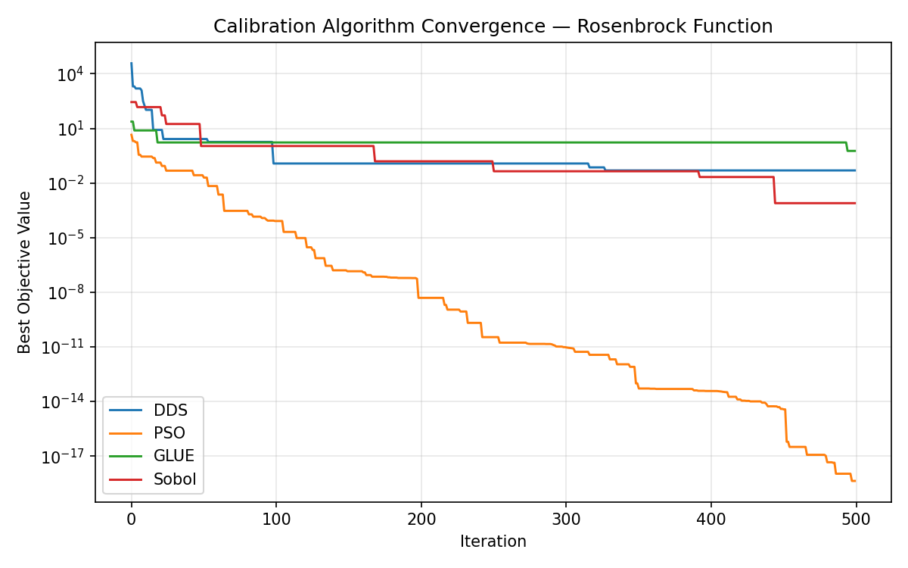

<!-- fingerprint:975ff3f40a5d3ba1c555a8040a78f878 -->
# Calibration Algorithm Benchmarks

*Last updated: 2026-04-19 10:02 UTC*

Synthetic benchmark on the **Rosenbrock** test function f(x,y) = (1−x)² + 100·(y−x²)²  with random starting points.

| Algorithm | Iterations | Best Objective | Convergence Rate |
|-----------|-----------|----------------|------------------|
| DDS | 500 | 4.893369e-02 | 100.00% |
| PSO | 500 | 4.285968e-19 | 100.00% |
| GLUE | 500 | 5.779055e-01 | 95.21% |
| Sobol | 500 | 7.783823e-04 | 99.62% |

*Convergence rate = fraction of total improvement achieved in the first 20% of iterations.*
