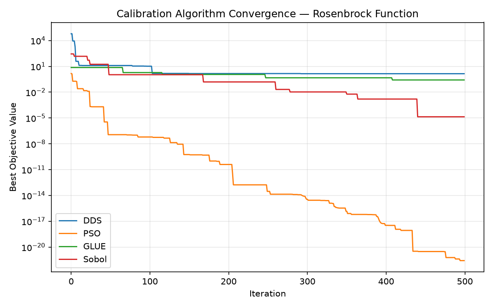

<!-- fingerprint:7f99b42affa515071d8ffa9ee21b42e2 -->
# Calibration Algorithm Benchmarks

*Last updated: 2026-08-04 10:40 UTC*

Synthetic benchmark on the **Rosenbrock** test function f(x,y) = (1−x)² + 100·(y−x²)²  with random starting points.

| Algorithm | Iterations | Best Objective | Convergence Rate |
|-----------|-----------|----------------|------------------|
| DDS | 500 | 5.556849e-01 | 99.99% |
| PSO | 500 | 7.704820e-22 | 100.00% |
| GLUE | 500 | 5.062120e-02 | 100.00% |
| Sobol | 500 | 3.031170e-02 | 99.63% |

*Convergence rate = fraction of total improvement achieved in the first 20% of iterations.*
