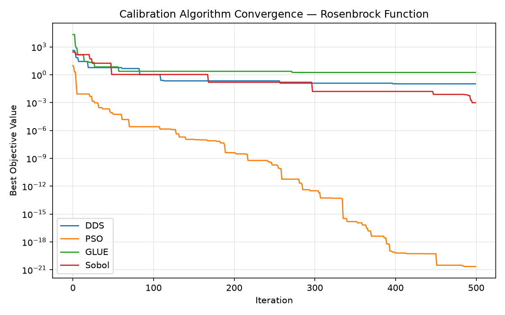

<!-- fingerprint:63fc9061fe676744da8108a2128969d6 -->
# Calibration Algorithm Benchmarks

*Last updated: 2026-10-09 09:55 UTC*

Synthetic benchmark on the **Rosenbrock** test function f(x,y) = (1−x)² + 100·(y−x²)²  with random starting points.

| Algorithm | Iterations | Best Objective | Convergence Rate |
|-----------|-----------|----------------|------------------|
| DDS | 500 | 1.897045e-01 | 100.00% |
| PSO | 500 | 1.518818e-17 | 100.00% |
| GLUE | 500 | 3.219597e-01 | 98.71% |
| Sobol | 500 | 8.070386e-04 | 99.62% |

*Convergence rate = fraction of total improvement achieved in the first 20% of iterations.*
